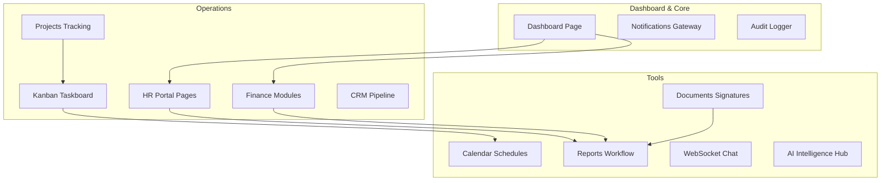
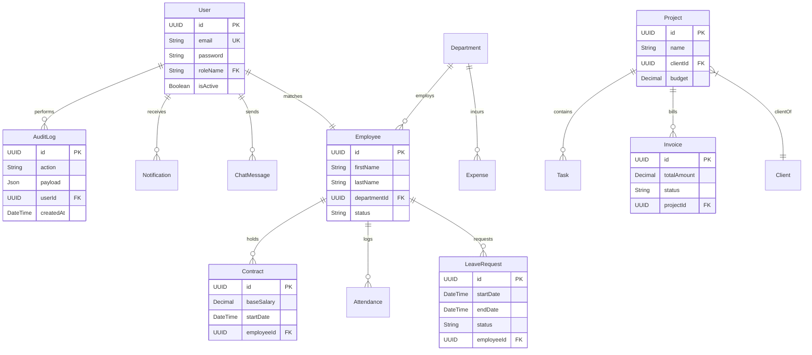

# AgencyOS: Complete System Reference & Architecture Documentation

AgencyOS is an enterprise-grade ERP and administrative OS platform designed for full agency management. This document provides a detailed blueprint of the entire codebase, user roles, database relationships, API routes, and page-by-page layout workflows.

---

## 1. System Architecture & Global Tech Stack

AgencyOS utilizes a modern decoupled Architecture:

```
┌────────────────────────────────────────────────────────┐
│                    React Client SPA                    │
│    (Vite, TypeScript, Tailwind, Recharts, Lucide)      │
└──────────────────────────┬─────────────────────────────┘
                           │ HTTPS (REST API) / WebSockets
                           ▼
┌────────────────────────────────────────────────────────┐
│                   NestJS API Gateway                   │
│   (TypeScript, JWT Guarding, PDFKit, ExcelJS, Cron)   │
└──────────────────────────┬─────────────────────────────┘
                           │ Prisma ORM
                           ▼
┌────────────────────────────────────────────────────────┐
│                   PostgreSQL Database                  │
│       (Relational schemas, indexing, constraints)      │
└────────────────────────────────────────────────────────┘
```

### Global Technology List
- **Frontend SPA:** React 18, TypeScript, Vite (build context), TailwindCSS & Vanilla CSS (variables design variables, glassmorphic layout tokens), React Router v6, TanStack React Query v5 (client-side query cache engine), Axios (HTTP Client), Recharts (data visualizations), Socket.io Client (real-time chat and alerts).
- **Backend API:** NestJS (modular framework), TypeScript, Prisma Client (database mapper), Passport-JWT (authentication), Socket.io / WebSockets (gateway alerts and chat rooms), PDFKit (PDF drawing compiler), ExcelJS (Excel worksheet generator).
- **Database:** PostgreSQL.

---

## 2. Global RBAC & Permissions Architecture

Access is governed by Role-Based Access Control (RBAC). The following roles are registered in the system:

| Role Name | System Role Code | General Scope Description |
| :--- | :--- | :--- |
| **CEO / Manager** | `GERANT` | Full platform read/write, global executive dashboards, review controls, project margins, audit tables. |
| **HR Manager** | `RESPONSABLE_RH` | HR Portal, employee listings, contract templates, recruitment boards, check-in schedules, leave reviews. |
| **Finance Manager**| `RESPONSABLE_FINANCIER`| Finance module, client invoicing, cashflow ledgers, expense validations, pay structures. |
| **Project Manager**| `CHEF_PROJET` | Project lists, task assignment boards, check-off parameters, resource metrics. |
| **Sales Manager** | `RESPONSABLE_VENTES` | CRM pipeline tracker, lead validation, account parameters. |
| **Marketing Manager**| `RESPONSABLE_MARKETING`| Marketing campaigns tracker, client profiles, campaign return rates. |
| **Secretariat** | `SECRETAIRE` | Basic office operations, basic reports views, document registries. |
| **Employee** | `COLLABORATEUR` | Employee dashboard portal, clock-in triggers, personal schedules, leaves submission, task assignments. |
| **Intern** | `STAGIAIRE` | Limited developer portal, assigned tasks checklists, hours clock-in triggers. |

---

## 3. Platform Modules, Pages & Features (14 Core Sections)



### Module 1: Dashboard Page (`/frontend/src/features/dashboard`)
- **Main View (`dashboard-page.tsx`):**
  - **Widgets:** Displays numerical metric cards summarizing active employees, ongoing projects, monthly revenue, pending leaves, and active notifications.
  - **Charts:** Weekly attendance rate curves and quarterly revenue lines.
  - **Dynamic Elements:** Personal profile banner, clock-in status panel, and a live activity feed.

### Module 2: HR (Human Resources) Portal (`/frontend/src/features/hr`)
- **Employees Directory (`employees-page.tsx`):** Detailed list of employee records (role, department, contract data, contact).
- **Leave Request Manager (`leaves-page.tsx`):**
  - *Employee Side:* Submit leave dates, reason, and type (paid, sick, unpaid).
  - *HR Side:* Approve or Reject leave requests, auto-calculating balance deductions.
- **Attendance Tracker (`attendance-page.tsx`):** Real-time list of employee check-ins/check-outs, late arrivals, and total daily worked hours.
- **Recruitment Pipeline (`recruitment-page.tsx`):** Kanban board managing candidates (Applied ➔ Phone Screen ➔ Technical Test ➔ Interview ➔ Offer Made).
- **Contracts Listing (`contracts-page.tsx`):** Tracks employee pay rates, probation dates, and duration types (CDI, CDD, SIVP).

### Module 3: Finance & Invoicing (`/frontend/src/features/finance`)
- **Invoice Generator (`invoices-page.tsx`):** Create invoices linked to projects. Exports PDF invoices with automatic tax rate additions.
- **Operating Expenses (`expenses-page.tsx`):** Expense reporting for employees. Invoices are scanned, uploaded, and approved by the Finance Manager or CEO.
- **Cashflow Dashboard (`cashflow-page.tsx`):** Real-time monitoring of cash inflow, paid invoices, and balance charts.

### Module 4: Project Management (`/frontend/src/features/projects`)
- **Projects Board (`projects-page.tsx`):** Track projects (Not Started ➔ In Progress ➔ On Hold ➔ Completed).
- **Timeline / Gantt View (`project-timeline-page.tsx`):** Renders project phases, deadlines, and resource timelines.
- **Project Detail View (`project-detail-page.tsx`):** Inside metrics showing margins, expenses, team allocation, and project tasks completion ratios.

### Module 5: Kanban Taskboard (`/frontend/src/features/tasks`)
- **Board View (`tasks-page.tsx`):** Drag-and-drop tasks columns (To Do, In Progress, Review, Done).
- **Task Panel (`task-detail-modal.tsx`):** Assign task members, configure checklist points, assign deadlines, and attach file documents.

### Module 6: CRM (Customer Relationship Management) (`/frontend/src/features/crm`)
- **Leads Pipeline (`leads-page.tsx`):** Tracks leads (New ➔ Contacted ➔ Qualified ➔ Negotiation ➔ Closed Won/Lost).
- **Client Profiles (`clients-page.tsx`):** Records communication logs, linked project histories, and outstanding balances.

### Module 7: Calendar Schedules (`/frontend/src/features/calendar`)
- **Calendar Page (`calendar-page.tsx`):** Drag-and-drop calendar interface showing meetings, project deadlines, and employee leave dates.

### Module 8: Chat Module (`/frontend/src/features/chat`)
- **Chat Portal (`chat-page.tsx`):** One-to-one direct messages and group chat channels. Implements real-time text delivery via Socket.io with unread indicators and active presence indicators.

### Module 9: Documents Repository (`/frontend/src/features/documents`)
- **Documents Dashboard (`documents-page.tsx`):** Central file explorer for contracts, receipts, and templates. Incorporates digital e-signature capabilities.

### Module 10: Department Reports Module (`/frontend/src/features/reports`)
- **Reports Dashboard (`reports-page.tsx`):** The reporting portal with specific workflows for managers (Draft ➔ Recalculate ➔ Submit) and the CEO (Approve ➔ Reject ➔ Request Modifications). Includes secure authenticated PDF Kit / Excel downloads.

### Module 11: AI Intelligence Hub (`/frontend/src/features/intelligence`)
- **NLP Insights Dashboard (`intelligence-page.tsx`):** Features automated performance predictions, NLP reports reviews, and recommendations.

### Module 12: Platform Audit Logs (`/frontend/src/features/audit`)
- **Audit Logs View (`audit-page.tsx`):** System ledger visible to the CEO. Tracks actions (e.g. employee deleted, payment made, login attempt) with date, author, IP address, and raw payload details.

### Module 13: WebSockets Alert System (`/frontend/src/features/notifications`)
- **Alert Center (`notification-dropdown.tsx`):** Dropdown displaying user alerts (e.g., leave request approved, task assigned, report submitted). Connects via WebSockets to push live toast alerts.

### Module 14: Settings & Customization (`/frontend/src/features/users`)
- **Settings Page (`settings-page.tsx`):** User profile modifications, password resets, visual theme controls, and administrator settings for user role permissions.

---

## 4. PostgreSQL Database Relationships & Schema Mapping

The database runs on a highly index-optimized PostgreSQL instance mapped through Prisma:



### Relational Integrity Details
- **Delete Constraints:** Critical references (like removing a Department) use protective database locks (`RESTRICT`), while task checklists use cascade deletion (`CASCADE`) on parent task deletion.
- **Polymorphic Storage:** Features like audit trails and dynamic KPIs use PostgreSQL `JsonB` fields for flexible, high-speed document indexing.

---

## 5. NestJS Core API Services & Backend Logic

### Authentication & RBAC Engine (`auth.service.ts`)
1. **Password Hashing:** Uses `bcrypt` with a work factor of 10 to hash and compare user credentials during login.
2. **Access token issue:** Signs payload configurations containing user ID, role, and permissions into JWT access tokens.
3. **Guards Evaluation:**
   - **`JwtAuthGuard`:** Validates signatures.
   - **`PermissionsGuard`:** Evaluates permissions matching endpoints metadata.
   - **`RolesGuard`:** Restricts actions based on role codes (`GERANT`, etc.).

### HR Metrics Engine (`hr.service.ts`)
- Queries database events:
  - Calculates absence rate from `Attendance` records.
  - Generates turnover statistics by calculating tenure spans on the `Employee` model.
  - Accumulates basic salaries on active `Contract` models.

### Finance Metrics Engine (`finance.service.ts`)
- Processes double-entry transactions:
  - Generates invoices using PDFKit templating.
  - Validates employee expense claims by evaluating image uploads.
  - Aggregates paid invoices to chart monthly revenue.

### Chat WebSocket Gateway (`chat.gateway.ts`)
- NestJS Gateway using Socket.io to keep client channels synchronized:
  - Intercepts connection events to bind client socket IDs to user IDs.
  - Receives `send_message` triggers, writes payload records to PostgreSQL, and broadcasts `new_message` packets to socket IDs in the room.

### Real-Time Alert System (`notifications.gateway.ts`)
- Broadcasts high-priority server notifications (e.g., leave status change, new invoice payment) directly to client browser views.

### PDF & Excel Generation Engines (`pdf.service.ts` / `excel.service.ts`)
- **PDF Generation:** Combines PDFKit canvas operations (lines, text wraps, fonts, page breaks) to output print-ready PDF binary buffers.
- **Excel Generation:** Employs ExcelJS to generate multi-sheet files with formatted summary cells, color coding, and computed formulas.
