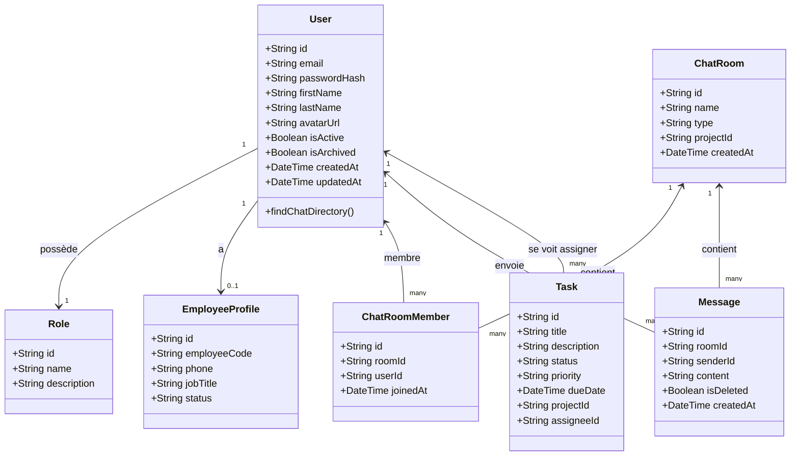
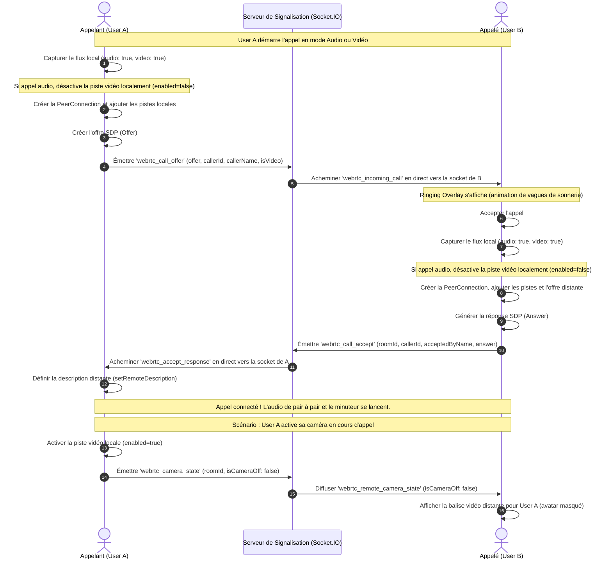

# Documentation Technique - AgencyOS

Bienvenue dans la documentation complète de **AgencyOS**, une plateforme ERP et collaborative moderne conçue pour rationaliser la gestion des opérations, des ressources humaines, de la facturation et de la communication en temps réel au sein de l'entreprise.

---

## 1. Vue d'Ensemble du Projet

AgencyOS s'articule autour d'une architecture client-serveur robuste avec un découpage clair :
- **Backend** : Construit avec **NestJS** (TypeScript), exploitant **Prisma ORM** pour communiquer avec une base de données relationnelle **PostgreSQL**. La communication bidirectionnelle en temps réel est gérée via **Socket.IO**.
- **Frontend** : Construit avec **React** (TypeScript) et **Vite**, stylisé avec **Tailwind CSS** et un système de thèmes personnalisé (supportant le Light Mode premium).
- **Communication en temps réel (Appels)** : Intégration de **WebRTC** de pair à pair pour les appels audio/vidéo avec signalisation WebSocket.

---

## 2. Diagramme de Cas d'Utilisation (Use Case Diagram)

Ce diagramme décrit les interactions principales des différents acteurs (Administrateurs/Gérants, Secrétaires, Collaborateurs) avec la plateforme AgencyOS.

```mermaid
leftToRightDirection
actor "Gérant / Administrateur" as Gerant
actor "Secrétaire" as Secretaire
actor "Collaborateur / Employé" as Collaborateur

rectangle AgencyOS {
  usecase "Gérer les utilisateurs et profils" as UC_Users
  usecase "Créer et affecter des Tâches" as UC_CreateTasks
  usecase "Glisser-déposer (Drag & Drop) les tâches" as UC_DragTasks
  usecase "Consulter son tableau de bord" as UC_Dashboard
  usecase "Gérer la facturation et devis (PDF)" as UC_Finance
  usecase "Démarrer une discussion (DM / Groupe)" as UC_Chat
  usecase "Passer des appels Audio/Vidéo" as UC_Calls
  usecase "Activer/Désactiver caméra en appel" as UC_ToggleCam
}

Gerant --> UC_Users
Gerant --> UC_CreateTasks
Gerant --> UC_Finance

Secretaire --> UC_Finance
Secretaire --> UC_CreateTasks

Collaborateur --> UC_DragTasks
Collaborateur --> UC_Dashboard

UC_Chat <-- Collaborateur
UC_Chat <-- Secretaire
UC_Chat <-- Gerant

UC_Calls <-- Collaborateur
UC_Calls <-- Gerant

UC_ToggleCam <-- UC_Calls
```

---

## 3. Diagramme de Classes (Class Diagram)

Ce diagramme représente la structure des données du backend modélisée avec Prisma, exposant les entités de base, leurs attributs et les relations clés.



---

## 4. Diagramme de Séquence : Signalisation d'Appel WebRTC

Le diagramme ci-dessous illustre le protocole complet d'établissement d'un appel audio/vidéo avec Messenger-level Camera Toggle (activation/désactivation dynamique de la caméra en temps réel sans coupure de flux).



---

## 5. Fonctionnalités et Modules Développés

### A. Messagerie et Discussions Privées (DMs)
- **Annuaire de chat sans restriction** : Intégration de la route `GET /users/chat/directory` pour permettre à tous les utilisateurs d'initier un DM avec n'importe quel membre actif sans nécessiter de permissions d'administration globale (`users:read`).
- **Gestion du plein écran** : Suppression du header et de la barre latérale globale sur la route `/chat`, maximisant la hauteur de la fenêtre (`h-screen`).
- **Retour au tableau de bord** : Ajout d'un bouton de navigation retour (`ArrowLeft`) au-dessus de la liste de canaux.

### B. Moteur d'Appel WebRTC (Messenger-level)
- **Aiguillage individuel de signalisation** : Remplacement des diffusions par canal socket (où les membres inactifs rataient les notifications) par des alertes ciblées directement sur l'identifiant de socket actif de chaque membre connecté dans la base de données.
- **Gestion dynamique de la caméra** : Capturation initiale continue des pistes vidéo. L'activation ou désactivation de la caméra désactive la piste sans détruire la connexion WebRTC, déclenchant des notifications socket en temps réel aux pairs connectés pour permuter entre l'avatar de profil et le flux vidéo en direct.
- **Visualisation moderne** : Thème Light mode premium, flous d'arrière-plan, minuteur de durée d'appel, et bouton de raccrochage flottant.

### C. Kanban Interactif avec Glisser-Déposer (Drag & Drop)
- **Fluidité UX** : Intégration de l'API HTML5 Drag and Drop standard sur les cartes de tâches du Kanban.
- **Changement de statut en direct** : Le glissement d'une carte vers une colonne (À faire, En cours, En révision, Fait, Bloqué) déclenche automatiquement une requête de mutation API asynchrone pour mettre à jour la tâche en base de données.
- **Animation d'accroche** : Survol des colonnes avec rétroaction visuelle (bordures illuminées et fond surligné).

### D. Templates de Documents PDF
- **Identité visuelle** : Intégration transparente du logo de l'entreprise sur tous les documents PDF générés (Factures, Devis, Rapports), avec repositionnement des en-têtes pour un rendu professionnel.

---

## 6. Lancement Local

### Backend (NestJS)
```bash
# Configuration de la base de données dans backend/.env
# Lancer les serveurs de développement
npm run start:dev
```

### Frontend (React + Vite)
```bash
npm run dev
```
