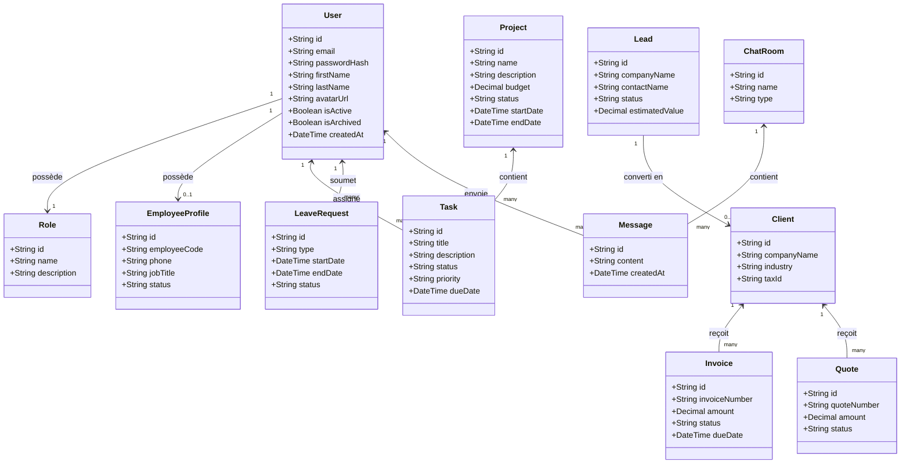
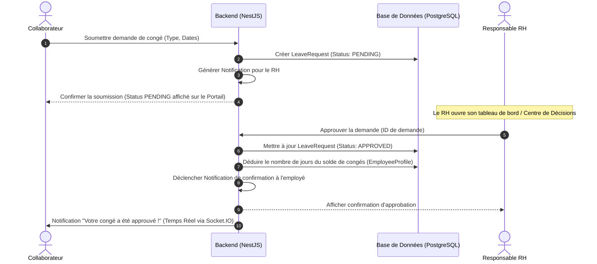
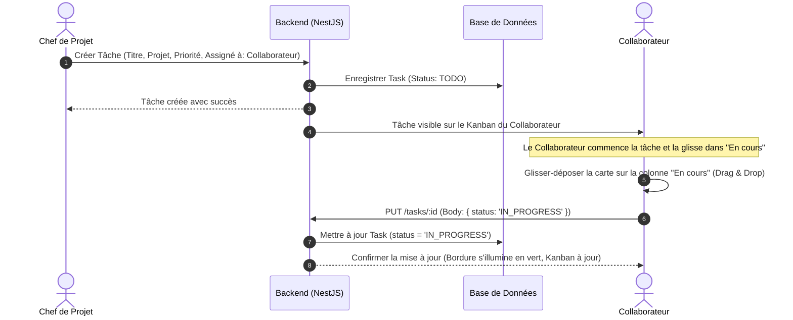
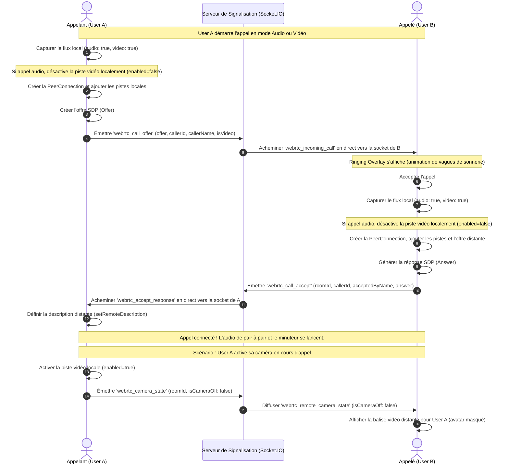

# Documentation Technique Complète - AgencyOS

Bienvenue dans la documentation de **AgencyOS**, une plateforme ERP et collaborative moderne de niveau entreprise conçue pour centraliser et automatiser les processus opérationnels, la relation client (CRM), les ressources humaines (RH), la finance et la communication en temps réel.

---

## 1. Architecture Système et Technologies

AgencyOS repose sur une stack technologique robuste et performante :

### Backend (NestJS + Prisma + PostgreSQL)
- **Framework** : NestJS (TypeScript), structuré en modules découplés (utilisant l'injection de dépendances).
- **Accès aux Données** : Prisma ORM, garantissant une communication typée avec une base de données PostgreSQL.
- **Temps Réel** : Socket.IO (WebSockets) intégré via des Gateways NestJS pour les notifications, la messagerie et la signalisation WebRTC.
- **Sécurité** : Guard JWT, chiffrement des mots de passe avec bcrypt, et contrôle d'accès basé sur les rôles et permissions (RBAC).

### Frontend (React + Vite + Tailwind CSS)
- **Framework** : React avec TypeScript et Vite pour un build ultra-rapide.
- **Thème & Design** : Tailwind CSS avec un système de variables CSS personnalisées pour le Light Mode et le Dark Mode premium.
- **Gestion d'État & Requêtes** : TanStack Query (React Query) pour le cache et la synchronisation avec le serveur.
- **WebRTC** : Hook personnalisé `useWebRTC` gérant la capture de flux média, le peer-to-peer et l'échange de candidats ICE.

---

## 2. Diagrammes de Modélisation UML

### A. Diagramme de Cas d'Utilisation Global (Use Case Diagram)
Ce diagramme détaille les permissions et les cas d'utilisation pour tous les rôles de l'entreprise (Gérant, RH, Comptable, Secrétaire, Chef de Projet, Collaborateur, Stagiaire) :

```mermaid
leftToRightDirection
actor "Gérant / CEO" as Gerant
actor "Responsable RH" as RH
actor "Responsable Financier" as Financier
actor "Secrétaire" as Secretaire
actor "Chef de Projet" as PM
actor "Collaborateur" as Collaborateur
actor "Stagiaire" as Stagiaire

rectangle AgencyOS {
  usecase "Gérer les utilisateurs et habilitations" as UC_UserAdmin
  usecase "Visualiser l'Intelligence Décisionnelle (IA)" as UC_DecisionIA
  
  usecase "Gérer les contrats et dossiers RH" as UC_RHAdmin
  usecase "Valider les demandes de congé" as UC_LeaveApproval
  usecase "Soumettre une demande de congé" as UC_LeaveSubmit
  
  usecase "Créer des factures et devis" as UC_FinanceDocs
  usecase "Approuver les factures et budgets" as UC_FinanceApprove
  
  usecase "Gérer les Leads & Clients (CRM)" as UC_CRM
  usecase "Organiser l'agenda & les réunions" as UC_Calendar
  
  usecase "Créer des projets et affecter des budgets" as UC_ProjectCreate
  usecase "Créer et affecter des Tâches" as UC_TasksAdmin
  usecase "Gérer ses tâches (Kanban Drag & Drop)" as UC_TasksUser
  
  usecase "Discuter en direct (DM & Groupes)" as UC_Chat
  usecase "Passer des appels audio/vidéo avec caméra" as UC_Calls
}

Gerant --> UC_UserAdmin
Gerant --> UC_DecisionIA
Gerant --> UC_FinanceApprove

RH --> UC_RHAdmin
RH --> UC_LeaveApproval

Financier --> UC_FinanceDocs
Financier --> UC_FinanceApprove

Secretaire --> UC_CRM
Secretaire --> UC_Calendar

PM --> UC_ProjectCreate
PM --> UC_TasksAdmin

Collaborateur --> UC_LeaveSubmit
Collaborateur --> UC_TasksUser
Collaborateur --> UC_Chat
Collaborateur --> UC_Calls

Stagiaire --> UC_TasksUser
Stagiaire --> UC_Chat
```

---

### B. Diagramme de Classes Complet (Class Diagram)
Ce diagramme montre la modélisation des entités sous Prisma et leurs relations :



---

### C. Diagramme de Séquence : Approbation de Congé (Workflow RH)
Flux de demande de congé par un employé et sa validation par le RH :



---

### D. Diagramme de Séquence : Cycle de Vie d'une Tâche (Kanban Drag & Drop)
Création d'une tâche et mise à jour dynamique par glisser-déposer :



---

### E. Diagramme de Séquence : Signalisation d'Appel WebRTC
Flux d'établissement d'appel en temps réel avec activation de la caméra en cours d'appel :



---

## 3. Description Détaillée des Modules

### 1. Authentification & Contrôle d'Accès (RBAC)
- **Fonctionnalités** : Connexion, renouvellement de jetons via refresh tokens, et protection des routes par rôles (Gérant, Secrétaire, HR, Financier, Chef de Projet, Collaborateur, Stagiaire) et permissions granulaires (`users:read`, `tasks:write`, `finance:read`, `hr:write`, `documents:write`, etc.).

### 2. CRM (Leads & Clients)
- **Leads** : Fiches prospects (source, statut, valeur estimée, devise). Le statut progresse de `NEW` à `CONTACTED` et `QUALIFIED`.
- **Clients** : Conversion de prospects qualifiés en comptes clients avec détails fiscaux (Matricule Fiscal), historique et facturation.

### 3. Finance & Facturation
- **Devis (Quotes) & Factures (Invoices)** : Gestion des montants, taxes, conditions et devises. Intégration de PDFKit pour générer dynamiquement des PDFs professionnels arborant le logo de l'entreprise.
- **Dépenses (Expenses)** : Enregistrement des frais de l'entreprise avec workflow de validation multi-étapes.

### 4. Ressources Humaines (RH)
- **Profils Employés** : Suivi des contrats, postes, téléphones, et départements.
- **Congés (Leave Requests)** : Demandes annuelles, maladie ou sans solde. Workflow de soumission pour les employés et d'approbation pour les RH avec mise à jour automatique des soldes.
- **Organigramme (Org Chart)** : Structure arborescente interactive des départements et des chaînes hiérarchiques de rapports.

### 5. Projets & Tâches
- **Projets** : Fiches projets avec budgets, dates limites, et affectation de collaborateurs.
- **Tableau Kanban** : Visualisation sous forme de colonnes (À faire, En cours, En révision, Fait, Bloqué). Prise en charge complète du Glisser-Déposer (HTML5 Drag & Drop) pour changer l'état des tâches avec persistance en base de données.

### 6. Messagerie & Appels de Groupe
- **Messagerie** : Salons de discussions généraux (canaux de projets, équipes) et messagerie directe (DMs). Accessible à tous les employés via l'annuaire de chat débridé.
- **Système d'Appels WebRTC** : Aiguillage direct par socket aux participants en ligne, support de la caméra à la volée (Messenger-level camera switch), affichage des participants en ligne et minuteur de durée d'appel.

### 7. Intelligence Center (IA & Décisionnel)
- **Centre de Décisions** : Console centralisée pour les Gérants afin de valider en un clic les devis, factures et congés.
- **Intelligence Artificielle** : Suggestions prédictives d'affectation des tâches aux membres d'équipe selon leur charge de travail.

---

## 4. Spécifications des Endpoints de l'API (Résumé)

| Module | Méthode | Route | Description |
| :--- | :--- | :--- | :--- |
| **Auth** | `POST` | `/api/v1/auth/login` | Authentification utilisateur & génération de JWT |
| **Users** | `GET` | `/api/v1/users/chat/directory` | Liste des utilisateurs actifs pour le chat (public) |
| **CRM** | `GET` | `/api/v1/crm/leads` | Récupère la liste des leads (CRM) |
| **Finance** | `POST` | `/api/v1/finance/invoices` | Création d'une nouvelle facture |
| **HR** | `POST` | `/api/v1/hr/leave-requests` | Soumission d'une demande de congé |
| **Tasks** | `PUT` | `/api/v1/tasks/:id` | Modification d'une tâche (ex: statut Kanban) |
| **Chat** | `GET` | `/api/v1/chat/rooms` | Liste des espaces de travail de chat |

---

## 5. Guide d'Installation et Lancement

### Prérequis
- Node.js (v18+)
- PostgreSQL installé et configuré
- Fichier `.env` configuré dans `backend/`

### Configuration et Seeding
```bash
# 1. Installer les dépendances backend
cd backend
npm install

# 2. Lancer les migrations Prisma & Seeder la base de données
npx prisma migrate dev --name init
npx prisma db seed

# 3. Lancer le serveur NestJS en mode développement
npm run start:dev
```

```bash
# 4. Installer les dépendances frontend
cd ../frontend
npm install

# 5. Lancer l'application web React
npm run dev
```
L'application est accessible à l'adresse `http://localhost:5173`.
