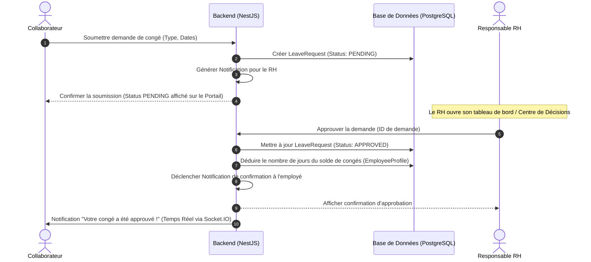
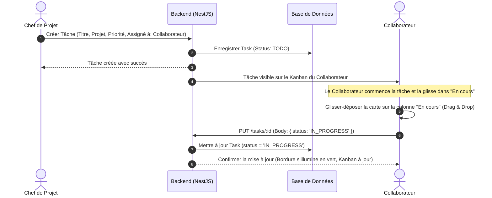
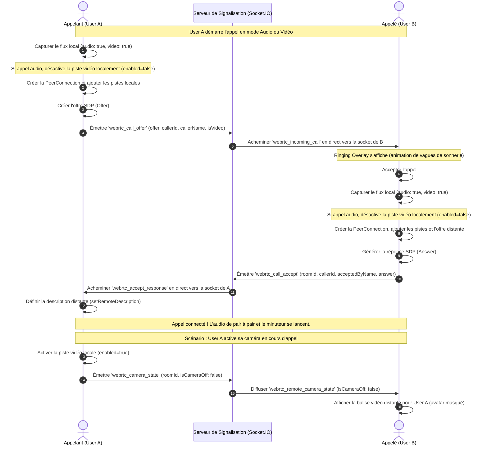

# Documentation Technique - AgencyOS

Bienvenue dans la documentation complète de **AgencyOS**, une plateforme ERP et collaborative moderne conçue pour rationaliser la gestion des opérations, des ressources humaines, de la facturation et de la communication en temps réel au sein de l'entreprise.

---

## 1. Vue d'Ensemble du Projet

AgencyOS s'articule autour d'une architecture client-serveur robuste avec un découpage clair :
- **Backend** : Construit avec **NestJS** (TypeScript), exploitant **Prisma ORM** pour communiquer avec une base de données relationnelle **PostgreSQL**. La communication bidirectionnelle en temps réel est gérée via **Socket.IO**.
- **Frontend** : Construit avec **React** (TypeScript) et **Vite**, stylisé avec **Tailwind CSS** et un système de thèmes personnalisé (supportant le Light Mode premium).
- **Communication en temps réel (Appels)** : Intégration de **WebRTC** de pair à pair pour les appels audio/vidéo avec signalisation WebSocket.

---

## 2. Diagramme de Cas d'Utilisation Global (Use Case Diagram)

Ce diagramme exhaustif décrit les droits et interactions de chaque rôle (Gérant, RH, Comptable, Secrétaire, Chef de Projet, Collaborateur, Stagiaire) avec les différentes pages et fonctionnalités du système.

```mermaid
leftToRightDirection
actor "Gérant / CEO" as Gerant
actor "Responsable RH" as RH
actor "Responsable Financier" as Financier
actor "Secrétaire" as Secretaire
actor "Chef de Projet" as PM
actor "Collaborateur" as Collaborateur
actor "Stagiaire" as Stagiaire

rectangle AgencyOS {
  usecase "Gérer les utilisateurs et habilitations" as UC_UserAdmin
  usecase "Visualiser l'Intelligence Décisionnelle (IA)" as UC_DecisionIA
  
  usecase "Gérer les contrats et dossiers RH" as UC_RHAdmin
  usecase "Valider les demandes de congé" as UC_LeaveApproval
  usecase "Soumettre une demande de congé" as UC_LeaveSubmit
  
  usecase "Créer des factures et devis" as UC_FinanceDocs
  usecase "Approuver les factures et budgets" as UC_FinanceApprove
  
  usecase "Gérer les Leads & Clients (CRM)" as UC_CRM
  usecase "Organiser l'agenda & les réunions" as UC_Calendar
  
  usecase "Créer des projets et affecter des budgets" as UC_ProjectCreate
  usecase "Créer et affecter des Tâches" as UC_TasksAdmin
  usecase "Gérer ses tâches (Kanban Drag & Drop)" as UC_TasksUser
  
  usecase "Discuter en direct (DM & Groupes)" as UC_Chat
  usecase "Passer des appels audio/vidéo avec caméra" as UC_Calls
}

Gerant --> UC_UserAdmin
Gerant --> UC_DecisionIA
Gerant --> UC_FinanceApprove

RH --> UC_RHAdmin
RH --> UC_LeaveApproval

Financier --> UC_FinanceDocs
Financier --> UC_FinanceApprove

Secretaire --> UC_CRM
Secretaire --> UC_Calendar

PM --> UC_ProjectCreate
PM --> UC_TasksAdmin

Collaborateur --> UC_LeaveSubmit
Collaborateur --> UC_TasksUser
Collaborateur --> UC_Chat
Collaborateur --> UC_Calls

Stagiaire --> UC_TasksUser
Stagiaire --> UC_Chat
```

---

## 3. Diagramme de Classes Détaillé (Class Diagram)

Ce diagramme représente la structure complète de la base de données relationnelle et la modélisation des entités sous Prisma.


---

## 4. Diagramme de Séquence : Workflow d'Approbation de Congé

Ce diagramme montre comment une demande de congé soumise par un Collaborateur transite par le backend pour être validée par le Responsable RH.



---

## 5. Diagramme de Séquence : cycle de vie d'une Tâche (Kanban Drag & Drop)

Ce diagramme montre la création d'une tâche par le Chef de Projet et sa mise à jour dynamique par glisser-déposer (Drag & Drop) par le Collaborateur.



---

## 6. Diagramme de Séquence : Signalisation d'Appel WebRTC

Le diagramme ci-dessous illustre le protocole complet d'établissement d'un appel audio/vidéo avec Messenger-level Camera Toggle (activation/désactivation dynamique de la caméra en temps réel sans coupure de flux).



---

## 7. Lancement Local

### Backend (NestJS)
```bash
# Configuration de la base de données dans backend/.env
# Lancer les serveurs de développement
npm run start:dev
```

### Frontend (React + Vite)
```bash
npm run dev
```
