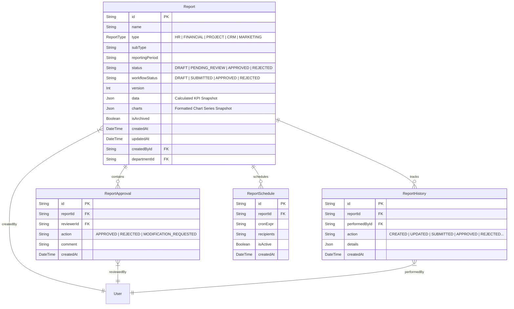

# Technical Architecture & API Documentation

This document provides a comprehensive overview of the technical stack, database models, backend integrations, and core service functions for the enterprise reporting system.

---

## 1. Technology Stack

### Frontend Architecture
- **Core Framework:** React 18 with TypeScript.
- **Build Tool:** Vite (for fast hot module replacement).
- **State Management & Data Fetching:** React Query (TanStack Query v5) for cache caching, optimistic UI updates, and query invalidation.
- **HTTP Client:** Axios (configured with intercepts for automatic JWT authorization header injection).
- **Styling:** Custom modern Vanilla CSS utilizing cohesive variables, HSL color palettes, dark mode aesthetics, and glassmorphism cards.
- **Icons & Visuals:** Lucide React for modern iconography, and Recharts for interactive dashboards and metric comparison charts.

### Backend Architecture
- **Core Framework:** NestJS with TypeScript (modular framework for building scalable enterprise applications).
- **ORM (Object-Relational Mapping):** Prisma Client (maps database models directly to type-safe TypeScript interfaces).
- **Authentication & Security:** JWT (JSON Web Tokens) with custom Guards (`JwtAuthGuard`, `RolesGuard`, `PermissionsGuard`) to enforce role-based access control (RBAC).
- **PDF Document Engine:** PDFKit (integrated into ReportsService using a buffered runner for professional 2-pass dynamic paging and styling).
- **Spreadsheet Generation:** ExcelJS (constructs multi-tab analytical spreadsheets for managers).

### Database Engine
- **Engine:** PostgreSQL.
- **Prisma Schema Mapping:** Keeps relations between user roles, department tables, employees data, and report workflows completely synchronized.

---

## 2. Database Models (Prisma Schema)

The reporting module is powered by four primary database tables in PostgreSQL.

### Main Relations
- **`Report.createdById`** links to **`User.id`** (who created the report).
- **`Report.departmentId`** links to **`Department.id`** (the department scope of the report).
- **`ReportApproval.reviewerId`** links to **`User.id`** (who performed the review).
- **`ReportHistory.performedById`** links to **`User.id`** (who audited the log action).

---

## 3. Backend Endpoints (NestJS ReportsController)

All endpoints reside under the base path `/api/v1/reports` and are secured via custom NestJS decorators.

| HTTP Method | Route Endpoint | Required Roles / Permissions | Input DTO / Body | Response Wrapper | Description |
| :--- | :--- | :--- | :--- | :--- | :--- |
| **GET** | `/reports` | `reports:read` | Query: `type`, `isArchived`, `workflowStatus`, `departmentId` | `{ data: Report[] }` | Retrieves the list of reports filtered by role. Filters out drafts for the CEO (`GERANT`). |
| **GET** | `/reports/ceo` | `reports:read` (CEO Only) | None | `{ data: Report[] }` | Returns all submitted, approved, or rejected reports for executive review. |
| **GET** | `/reports/dashboard` | `reports:read` | None | `{ data: ReportStats }` | Returns aggregated workflow stats (total, pending, approved, rejected). |
| **GET** | `/reports/analytics/compare` | `reports:read` (CEO Only) | None | `ComparisonAnalytics[]` | Returns productivity, expenses, and budget utilization comparison across departments. |
| **GET** | `/reports/:id` | `reports:read` | Path: `id` | `Report` | Returns a single report. Serves frozen snapshotted data for submitted/approved/rejected reports, or live-calculated data for drafts. |
| **GET** | `/reports/:id/data` | `reports:read` | Path: `id` | `ReportDataSnapshot` | Returns flattened KPI variables formatted specifically for edit/view form fields. |
| **POST** | `/reports` | `reports:write` (Managers) | `CreateReportDto` | `Report` | Generates a new activity report and calculates initial stats from PostgreSQL modules. |
| **PATCH** | `/reports/:id` | `reports:write` (Managers) | `UpdateReportDto` | `Report` | Updates draft text fields (Executive Summary, Notes, Observations). |
| **POST** | `/reports/:id/save` | `reports:write` (Managers) | `UpdateReportDto` | `Report` | Alternative POST alias for updating and saving drafts. |
| **POST** | `/reports/:id/run` | `reports:write` (Managers) | None | `Report` | Re-runs analytics on a draft report to pull fresh live database data. |
| **POST** | `/reports/:id/submit` | `reports:write` (Managers) | None | `Report` | Freezes current statistics and charts, saving them into PostgreSQL, and submits it to the CEO. |
| **PATCH** | `/reports/:id/approve` | `reports:write` (CEO Only) | `{ comment?: string }` | `Report` | Approves a submitted report, sets status to `APPROVED`, and logs it. |
| **POST** | `/reports/:id/approve` | `reports:write` (CEO Only) | `{ comment?: string }` | `Report` | Alternative POST alias for approving. |
| **PATCH** | `/reports/:id/reject` | `reports:write` (CEO Only) | `{ reason: string }` | `Report` | Declines a submitted report, sets status to `REJECTED`, and logs it. |
| **POST** | `/reports/:id/reject` | `reports:write` (CEO Only) | `{ reason: string }` | `Report` | Alternative POST alias for declining. |
| **PATCH** | `/reports/:id/request-modifications`| `reports:write` (CEO Only)| `{ comment: string }` | `Report` | Reverts report to a editable `DRAFT` status and comments modifications. |
| **GET** | `/reports/export/pdf/:id` | `reports:read` | Path: `id` | Binary PDF Buffer | Generates and exports the professional executive PDFKit document. |
| **GET** | `/reports/:id/pdf` | `reports:read` | Path: `id` | Binary PDF Buffer | Alternative GET alias for PDF export. |
| **GET** | `/reports/export/excel/:id` | `reports:read` | Path: `id` | Binary XLSX Buffer | Generates and exports the ExcelJS spreadsheet data. |
| **POST** | `/reports/:id/schedules` | `reports:write` | `CreateReportScheduleDto`| `ReportSchedule` | Registers a CRON schedule to auto-generate and email reports. |

---

## 4. Backend Service Core Functions (`ReportsService`)

### Live Metric Calculations (`generateHrReportData` & `generateFinanceReportData`)
When a manager creates a new report, or clicks the refresh button on a draft, `ReportsService` queries PostgreSQL tables directly:
- **HR Statistics:** Queries `Employee`, `Department`, `Attendance`, `LeaveRequest`, `Contract`, and `Recruitment` models to calculate exact metrics (Total employees, Interns count, Turnover rate, Payroll total, Average salary, Attendance rate, Task completion ratios).
- **Finance Statistics:** Queries `Invoice`, `Expense`, and `Transaction` models to calculate KPIs (Total Revenue, Operating Expenses, Net Margin, Outstanding Cash receivables) localized to **Tunisian Dinar (TND)**.

### Submission & Snapshotting (`submitReport`)
To prevent changes in live data (e.g. employee count or monthly revenue) from altering historical reports, the submission step takes a frozen snapshot:
1. Calculates fresh live stats.
2. Compiles final charts (e.g., Department headcount distributions, Revenue/Expense trends).
3. Saves these JSON objects directly inside the `data` and `charts` JSONB columns in PostgreSQL.
4. Marks `workflowStatus` as `'SUBMITTED'`.
5. Future calls to `findOne` bypass live queries and return this immutable snapshot directly.

### CEO Actions (`approveReport`, `rejectReport`, `requestModifications`)
- **Approve:** Updates status and workflow status to `APPROVED`. Writes an entry into the `ReportApproval` and `ReportHistory` tables. Triggers a gateway notification back to the reporting manager.
- **Reject:** Sets status to `REJECTED`, stores the decline reason, logs it, and triggers a real-time notification.
- **Request Modifications:** Reverts the workflow status back to `DRAFT` (while keeping `status` as `PENDING_REVIEW` or flag comments), which allows the manager to modify and resubmit the report.

### Professional PDF Generation Engine (`exportPdf`)
Constructs an executive PDF document using a buffered two-pass layout:
1. **Header Border:** Draws a dark primary accent line at the top of every page.
2. **Page Footers:** Loops through the document pages using a buffer, stamp-drawing `"CREATIVART — CONFIDENTIEL"` on the bottom left, and `"Page X sur Y"` on the bottom right.
3. **Structured KPI Grid:** Builds solid bounding grid cards using layout vectors with a colored left-border accent to frame key numbers.
4. **Contextual Callout Panels:** Places manager comments, observations, and decisions inside shaded callout panels (slate for notes, emerald for approvals, red for declines) with clean typographic hierarchy.
5. **Page Boundaries Safety:** Computes margins and triggers manual page breaks prior to drawing blocks to prevent clipping.
